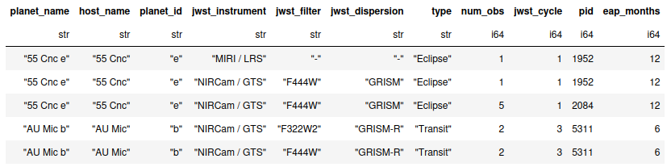
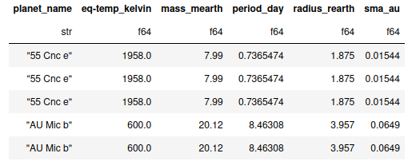
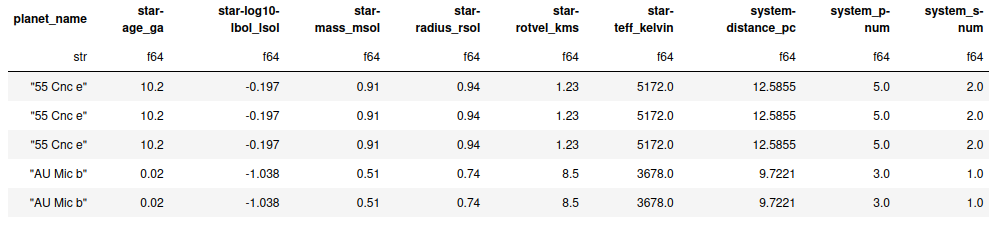
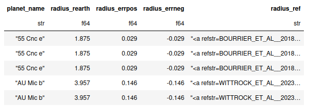

# JWST Target Query

This is a small script to query the NASA Exoplanet Archive (LINK) for system parameters of planned and already executed JWST transmission, emission, and phase curve observations.

The script queries the [`ps_comppars`](https://exoplanetarchive.ipac.caltech.edu/docs/API_PS_columns.html) table from the EPA, to find as many values as possible. Unfortunately, that means that for an individual planet, these values might not always be consistent with one another. To mitigate / account for this, the query script produces two outputs for each query:

1. A reduced list of all queried parameters (in `output/jtp_*.csv`)
2. A full list of all queried parameters, including their associated uncertainties and source publications (in `ouput/parameters_full/jtp_full_*.csv`)

## Input
`jwst_target-list_cycles.xlsx` is a user-created spreadsheet (by me) with individual information about planned observations for each target in each cycle. It contains sheets for each observational cycle, and shouldn't be used by itself. The sheets can be exported individually to csv-files, which are used as the general input for the routine here.

I created these lists by hand (and will update them) every time the results for a new observational cycle are announced.

## Output
The general output of the routine is split into overall information, planet parameters, and host star parameters.

The general parameters are related to the observation campaign, and include the instrument, dispersion element, and filter:

The planetary parameters include relevant physical parameters:

Finally, the system parameters include relevant physical parameters of the star, and ancillary information such as system distance and multiplicity:

All physical parameters also include uncertainties and corresponding publication references, as indicated below:

## ToDos:
- The exoplanet archive carries a keyword specifying if any values are limits (e.g. planetary radius or mass). It would be important to include this!
- Add a column with indicator on published spectra
- Can I query MAST to see if raw data is available

